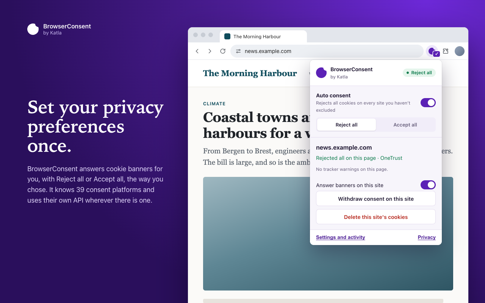
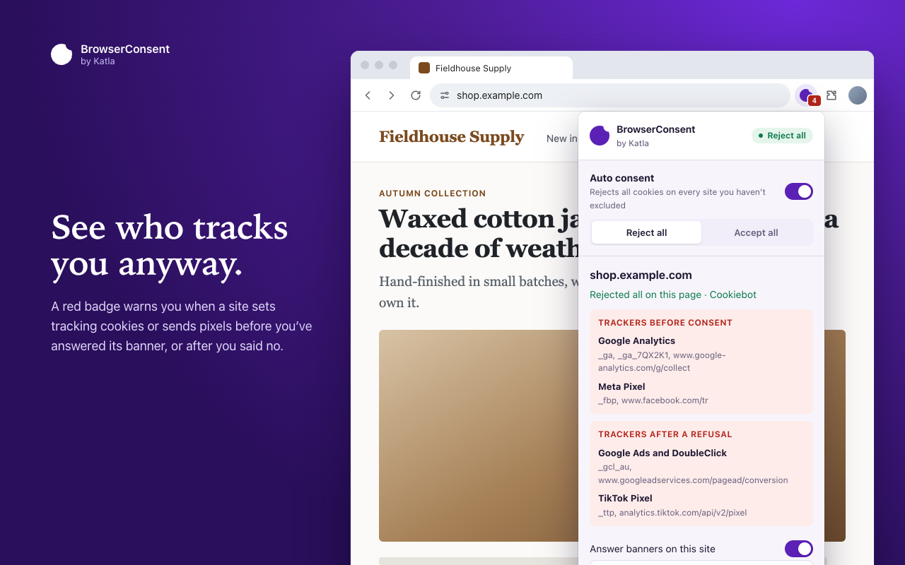
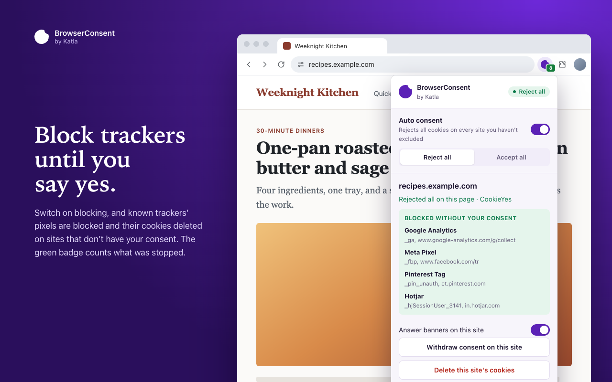
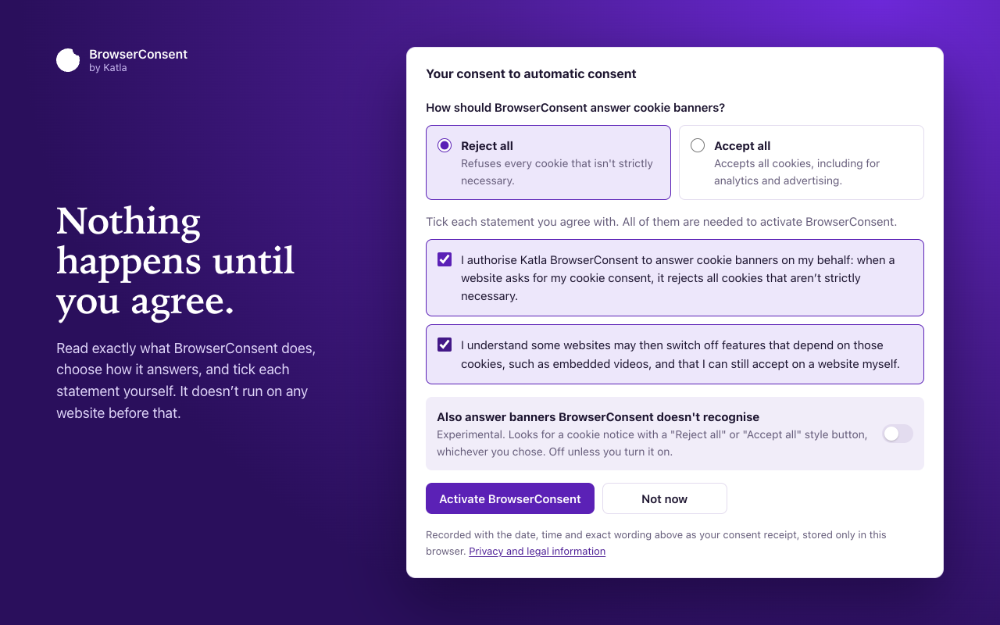
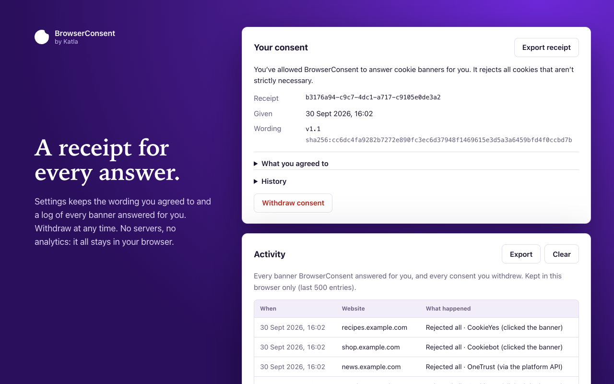

<p align="center">
  <a href="https://katla.app">
    <picture>
      <source media="(prefers-color-scheme: dark)" srcset="assets/logo/katla-logo-dark.svg">
      
    </picture>
  </a>
</p>

<h1 align="center">BrowserConsent</h1>

<p align="center">
  <strong>Set your privacy preferences once. Katla handles cookie banners for you.</strong>
</p>

<p align="center">
  <a href="https://chromewebstore.google.com/detail/katla-browserconsent-auto/obcgpaekemgfbdninooddanpgkldagkc">Chrome Web Store</a> ·
  <a href="#install">Install</a> ·
  <a href="#how-to-use-it">How to use it</a> ·
  <a href="#privacy">Privacy</a> ·
  <a href="#about-katla">About Katla</a>
</p>

BrowserConsent is an open source browser extension for Chrome and Firefox, made by [Katla](https://katla.app). Tell it once how you want cookie banners answered, **Reject all** or **Accept all**, and it gives every website that answer for you. It also shows you which sites track you anyway.



## What it does

- **Answers cookie banners for you.** Pick Reject all or Accept all once, and BrowserConsent gives every site that answer.
- **Knows the banners you actually meet.** It recognises [39 consent platforms](#supported-consent-platforms), among them OneTrust, Cookiebot, Usercentrics, Didomi, Sourcepoint and TrustArc.
- **Warns you about trackers.** The toolbar badge turns red when a site sets a tracking cookie or sends a pixel before you've answered its banner, or after you said no. It knows 34 common trackers, such as Google Analytics, Meta Pixel and TikTok.
- **Blocks them, if you want.** Switch on blocking and those trackers are stopped on every site that doesn't have your consent.
- **Keeps a record.** You get a receipt of exactly what you agreed to and a log of every banner answered for you. Export them or withdraw at any time.
- **Collects nothing.** No servers, no analytics, no remote code. Everything stays in your browser.

<table>
  <tr>
    <td width="50%"></td>
    <td width="50%"></td>
  </tr>
  <tr>
    <td width="50%"></td>
    <td width="50%"></td>
  </tr>
</table>

## Install

BrowserConsent needs Chrome 111 or Firefox 140, or newer.

### Chrome, Edge, Brave and other Chromium browsers

Get it from the [Chrome Web Store](https://chromewebstore.google.com/detail/katla-browserconsent-auto/obcgpaekemgfbdninooddanpgkldagkc) and click **Add to Chrome**. The store keeps it up to date for you.

### Firefox

On Firefox you install it by hand:

1. Download `katla-browserconsent-firefox-<version>.zip` from the [latest release](https://github.com/katla-app/browserconsent/releases/latest).
2. Open `about:debugging#/runtime/this-firefox`.
3. Click **Load Temporary Add-on** and pick the zip.

Firefox only keeps an unsigned add-on until it restarts, so you'll need to load it again next time.

### Chrome, by hand

You can also load a release in Chrome yourself instead of using the store:

1. Download `katla-browserconsent-chrome-<version>.zip` from the [latest release](https://github.com/katla-app/browserconsent/releases/latest).
2. Unzip it into its own folder, somewhere you'll keep it. Chrome loads the extension from that folder, so don't move or delete it afterwards.
3. Open `chrome://extensions` and turn on **Developer mode**.
4. Click **Load unpacked** and pick the folder.

A copy installed by hand doesn't update itself. To update it, replace the folder's contents with the new release and click the reload button on BrowserConsent's card in `chrome://extensions`.

Chrome treats a copy installed by hand and the one from the store as different extensions, so your settings and receipt don't carry over between them. If you installed by hand before the store listing went live, remove that copy and install from the store.

## How to use it

1. **Read and agree.** A welcome page opens after you install. It explains what BrowserConsent does and what it means for your privacy. Choose Reject all or Accept all, tick each statement, and click **Activate BrowserConsent**. Until you do, it doesn't run on any website.
2. **Browse as usual.** When a site shows a cookie banner, BrowserConsent answers it the way you chose.
3. **Look at the toolbar button.** The badge tells you what happened on the page you're on:

   | Badge | What it means |
   | --- | --- |
   | A tick | The site's cookie banner was answered |
   | A red number | That many trackers were used before consent, or after a refusal |
   | A green number | That many tracking cookies and pixels were blocked |

4. **Click it for more.** The popup shows what was answered and which trackers were flagged. From there you can switch between Reject all and Accept all, turn BrowserConsent off for the site, withdraw your consent on it, or delete its cookies.
5. **Change anything in Settings.** Open **Settings and activity** from the popup to turn tracker warnings and blocking on or off, list sites where BrowserConsent should stay off, and see your receipt and activity log.

A few things that are useful to know:

- **Your own click always wins.** Banners you've already answered are left alone, and BrowserConsent steps aside as soon as you click or type on a page.
- **No way to reject on the first screen? It's left for you.** BrowserConsent doesn't click through a banner's settings screens to find one.
- **Accept all is a real consent.** Websites and their partners may then use cookies for analytics, personalisation and advertising under their own privacy policies, so BrowserConsent asks you to agree to that separately.
- **Blocking is off until you turn it on.** Some sites may not work fully with it on.
- **Banners it doesn't recognise are left alone.** There's an experimental option in Settings to answer those too, by their "Reject all" or "Accept all" button, in 12 languages.

## Supported consent platforms

Katla, OneTrust, Cookiebot, Usercentrics, Didomi, InMobi Choice (Quantcast), Sourcepoint, TrustArc, Google Funding Choices, Google, Complianz, CookieYes, Osano, Klaro, iubenda, Termly, Borlabs Cookie, CookieFirst, consentmanager.net, Axeptio, Cookie Information, CookieHub, Civic Cookie Control, Tealium, Piwik PRO, Crownpeak (Evidon), CookieScript, GDPR Cookie Compliance (Moove), Cookie Notice & Compliance, Secure Privacy, Cookie Tractor, CookieConsent, Cookie Consent (Insites), HubSpot, Shopify, Wix, Ezoic, Amazon and Meta (Facebook, Instagram).

Where a platform has its own JavaScript API, BrowserConsent records your choice through it, so the site's consent record is updated the way the platform intends. Otherwise it presses the banner's matching button.

Met a banner it doesn't answer? [Open an issue](https://github.com/katla-app/browserconsent/issues) with the site's address.

## Privacy

Katla collects nothing. BrowserConsent has no servers, no analytics and no remote code. Your settings, receipt and activity log stay in your browser, and uninstalling removes them.

- [PRIVACY.md](PRIVACY.md): what's stored on your device, and what each browser permission is used for.
- [LEGAL.md](LEGAL.md): how BrowserConsent is built so that the consent it gives is really yours.

## For developers

```bash
npm install
npm run build   # dist/chrome and dist/firefox, and a zip of each
npm test        # end-to-end tests in a real browser
```

Load `dist/chrome` with *Load unpacked* in `chrome://extensions`, or `dist/firefox/manifest.json` with *Load Temporary Add-on* in `about:debugging#/runtime/this-firefox`.

[DEVELOPMENT.md](DEVELOPMENT.md) has the rest: how it works, how to set up browsers for the tests, how to add a consent platform or a tracker, and how to release.

## About Katla

[Katla](https://katla.app) is a cookie consent platform for websites. It scans your site, finds and classifies the cookies it sets, and gives you a consent banner that stays up to date with them, as a hosted widget or an SDK, for GDPR and CCPA.

BrowserConsent is the visitor's side of that. Sites that use Katla are answered through Katla's own API, and developers of those sites get a debug log in Settings that shows how Katla is set up on the page.

Run a website? Have a look at [katla.app](https://katla.app) or the [docs](https://docs.katla.app).

## License

MIT. See [LICENSE](LICENSE).
